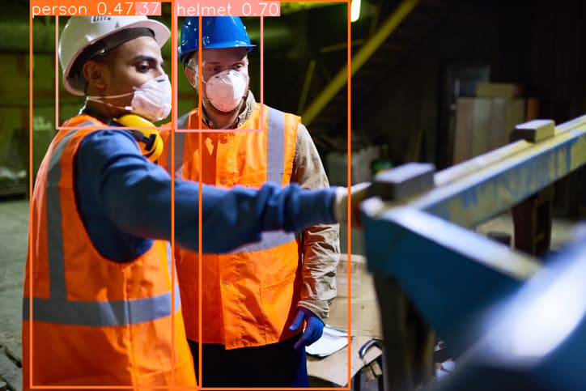

# Project-YOLOv10-Helmet-Safety-Detection

This project aims at detecting helmets in images. This project utilizes the YOLOv10 model for performing real-time object detection and is built using Python and Streamlit.

## Installation
### Clone the Repository
```bash
git clone https://github.com/NhtJm/Project-YOLOv10-Helmet-Safety-Detection.git
cd Project-YOLOv10-Helmet-Safety-Detection
```

### Install Dependencies
```bash
pip install -r requirement.txt
```

## Usage
### Running Streamlit App
To launch the Streamlit web application to visualize the results:
```bash
streamlit run source/streamlit_app.py
```

## Demo
Output
<p align='center'>
  
